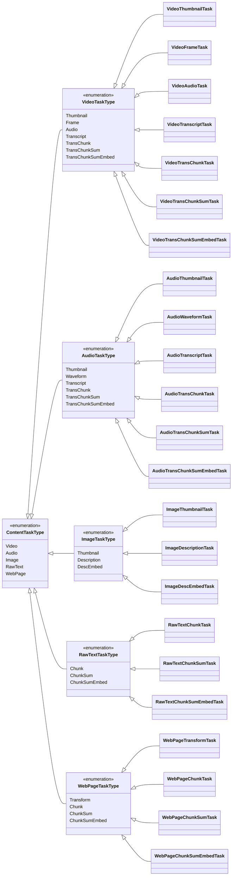

# content-base-task

This crate provides task implementations for processing different types of content (video, audio, images, text, web pages) in the GenDAM project.

## Features

- Modular task system for different content types
- Async task execution
- Integration with AI models for tasks like transcription and summarization
- File storage and caching of task outputs

## Main Components

- `ContentTask` trait - Defines the interface for all content processing tasks
- `ContentTaskType` enum - Represents the different types of tasks available
- Task implementations for:
  - Video processing
  - Audio processing
  - Image processing
  - Raw text processing
  - Web page processing

## Usage

Tasks can be executed on content files like this:

```rust
let file_info = FileInfo {
    file_identifier: "abc123".into(),
    file_path: PathBuf::from("/path/to/file.mp4")
};

let ctx = ContentBaseCtx::new(...);

let task = VideoTranscriptTask;
task.run(&file_info, &ctx).await?;
```

See the test modules for more detailed usage examples.

## Task Types

- Video: Thumbnail, Frame extraction, Audio extraction, Transcription, etc.
- Audio: Transcription, Chunking, Summarization, etc.
- Image: Thumbnail, Description, Embedding
- Raw Text: Chunking, Summarization, Embedding
- Web Page: HTML to Markdown conversion, Chunking, Summarization, Embedding

## Dependencies

This crate relies on several other crates in the GenDAM project:

- `content-base-context`
- `content-handler`
- `ai`
- `storage`

As well as external crates like `tokio`, `async-trait`, `serde`, etc.

## Testing

Run tests with:

```
cargo test
```

Some tests require AI model files to be present. See test modules for details.

## ContentTask Derive 宏

`ContentTask` 是一个自定义的派生宏，用于自动为枚举类型实现 `ContentTask` trait。具体来说，宏会生成以下方法的实现：

- `inner_run`
- `task_parameters`
- `task_output`
- `task_dependencies`

### 使用方法

要使用 `ContentTask` 派生宏，请按照以下步骤操作：

1. 确保您的项目依赖中包含 `content-base-derive` crate。

2. 在您的枚举定义上方添加 `#[derive(ContentTask)]` 属性：

```rust
use content_base_derive::ContentTask;

#[derive(Clone, Debug, EnumIter, EnumString, strum_macros::Display, ContentTask, Storage)]
#[strum(serialize_all = "kebab-case")]
pub enum VideoTaskType {
    Thumbnail(VideoThumbnailTask),
    Frame(VideoFrameTask),
    Audio(VideoAudioTask),
    Transcript(VideoTranscriptTask),
    TransChunk(VideoTransChunkTask),
    TransChunkSum(VideoTransChunkSumTask),
    TransChunkSumEmbed(VideoTransChunkSumEmbedTask),
}
```

3. 每一个枚举成员都应该包含一个对应的任务实现，如上例中的 `VideoThumbnailTask`，并且该任务实现应该实现 `ContentTask` trait。

### 以 `VideoTaskType` 为例，派生宏会生成以下代码：

```rust
#[async_trait::async_trait]
impl crate::ContentTask for VideoTaskType {
    async fn inner_run(
        &self,
        file_info: &crate::FileInfo,
        ctx: &content_base_context::ContentBaseCtx,
        task_run_record: &mut crate::record::TaskRunRecord
    ) -> anyhow::Result<()> {
        match self {
            VideoTaskType::Thumbnail(field0) => {
                field0.inner_run(file_info, ctx, task_run_record).await
            }
            VideoTaskType::Frame(field0) => {
                field0.inner_run(file_info, ctx, task_run_record).await
            }
            VideoTaskType::Audio(field0) => {
                field0.inner_run(file_info, ctx, task_run_record).await
            }
            VideoTaskType::Transcript(field0) => {
                field0.inner_run(file_info, ctx, task_run_record).await
            }
            VideoTaskType::TransChunk(field0) => {
                field0.inner_run(file_info, ctx, task_run_record).await
            }
            VideoTaskType::TransChunkSum(field0) => {
                field0.inner_run(file_info, ctx, task_run_record).await
            }
            VideoTaskType::TransChunkSumEmbed(field0) => {
                field0.inner_run(file_info, ctx, task_run_record).await
            }
        }
    }

    fn task_parameters(&self, ctx: &content_base_context::ContentBaseCtx) -> serde_json::Value {
        match self {
            VideoTaskType::Thumbnail(field0) => {
                field0.task_parameters(ctx)
            }
            VideoTaskType::Frame(field0) => {
                field0.task_parameters(ctx)
            }
            VideoTaskType::Audio(field0) => {
                field0.task_parameters(ctx)
            }
            VideoTaskType::Transcript(field0) => {
                field0.task_parameters(ctx)
            }
            VideoTaskType::TransChunk(field0) => {
                field0.task_parameters(ctx)
            }
            VideoTaskType::TransChunkSum(field0) => {
                field0.task_parameters(ctx)
            }
            VideoTaskType::TransChunkSumEmbed(field0) => {
                field0.task_parameters(ctx)
            }
        }
    }

    async fn task_output(
        &self,
        task_run_record: &crate::record::TaskRunRecord
    ) -> anyhow::Result<crate::record::TaskRunOutput> {
        match self {
            VideoTaskType::Thumbnail(field0) => {
                field0.task_output(task_run_record).await
            }
            VideoTaskType::Frame(field0) => {
                field0.task_output(task_run_record).await
            }
            VideoTaskType::Audio(field0) => {
                field0.task_output(task_run_record).await
            }
            VideoTaskType::Transcript(field0) => {
                field0.task_output(task_run_record).await
            }
            VideoTaskType::TransChunk(field0) => {
                field0.task_output(task_run_record).await
            }
            VideoTaskType::TransChunkSum(field0) => {
                field0.task_output(task_run_record).await
            }
            VideoTaskType::TransChunkSumEmbed(field0) => {
                field0.task_output(task_run_record).await
            }
        }
    }

    fn task_dependencies(&self) -> Vec<crate::ContentTaskType> {
        match self {
            VideoTaskType::Thumbnail(field0) => {
                field0.task_dependencies()
            }
            VideoTaskType::Frame(field0) => {
                field0.task_dependencies()
            }
            VideoTaskType::Audio(field0) => {
                field0.task_dependencies()
            }
            VideoTaskType::Transcript(field0) => {
                field0.task_dependencies()
            }
            VideoTaskType::TransChunk(field0) => {
                field0.task_dependencies()
            }
            VideoTaskType::TransChunkSum(field0) => {
                field0.task_dependencies()
            }
            VideoTaskType::TransChunkSumEmbed(field0) => {
                field0.task_dependencies()
            }
        }
    }
}
```

## ContentTaskType 的层级结构

1. ContentTaskType (枚举)
   - 这是最顶层的任务类型枚举
   - 包含所有主要内容类型的任务
   - 变体: Video, Audio, Image, RawText, WebPage

2. VideoTaskType (枚举)
   - ContentTaskType::Video 的具体实现
   - 包含所有视频相关的任务类型
   - 变体: Thumbnail, Frame, Audio, Transcript, TransChunk, TransChunkSum, TransChunkSumEmbed

3. AudioTaskType (枚举)
   - ContentTaskType::Audio 的具体实现
   - 包含所有音频相关的任务类型
   - 变体: Thumbnail, Waveform, Transcript, TransChunk, TransChunkSum, TransChunkSumEmbed

4. ImageTaskType (枚举)
   - ContentTaskType::Image 的具体实现
   - 包含所有图像相关的任务类型
   - 变体: Thumbnail, Description, DescEmbed

5. RawTextTaskType (枚举)
   - ContentTaskType::RawText 的具体实现
   - 包含所有原始文本相关的任务类型
   - 变体: Chunk, ChunkSum, ChunkSumEmbed

6. WebPageTaskType (枚举)
   - ContentTaskType::WebPage 的具体实现
   - 包含所有网页相关的任务类型
   - 变体: Transform, Chunk, ChunkSum, ChunkSumEmbed

具体任务结构体:
- VideoThumbnailTask (结构体)
- VideoFrameTask (结构体)
- VideoAudioTask (结构体)
- VideoTranscriptTask (结构体)
- VideoTransChunkTask (结构体)
- VideoTransChunkSumTask (结构体)
- VideoTransChunkSumEmbedTask (结构体)
- AudioThumbnailTask (结构体)
- AudioWaveformTask (结构体)
- AudioTranscriptTask (结构体)
- AudioTransChunkTask (结构体)
- AudioTransChunkSumTask (结构体)
- AudioTransChunkSumEmbedTask (结构体)
- ImageThumbnailTask (结构体)
- ImageDescriptionTask (结构体)
- ImageDescEmbedTask (结构体)
- RawTextChunkTask (结构体)
- RawTextChunkSumTask (结构体)
- RawTextChunkSumEmbedTask (结构体)
- WebPageTransformTask (结构体)
- WebPageChunkTask (结构体)
- WebPageChunkSumTask (结构体)
- WebPageChunkSumEmbedTask (结构体)

关系:
1. ContentTaskType 是最顶层的枚举,包含所有主要内容类型的任务。
2. 每个主要内容类型(Video, Audio等)都有一个对应的TaskType枚举(VideoTaskType, AudioTaskType等)。
3. 每个具体的TaskType枚举包含该内容类型的所有具体任务。
4. 每个具体任务都有一个对应的结构体实现(如VideoThumbnailTask)。

类型:
- ContentTaskType, VideoTaskType 等是枚举类型。
- VideoThumbnailTask 等是结构体类型。

差异:
1. ContentTaskType 是最通用的类型,用于表示任何类型的内容任务。
2. VideoTaskType 等二级枚举更具体,仅表示特定内容类型的任务。
3. VideoThumbnailTask 等结构体是最具体的实现,包含实际执行任务的逻辑。


